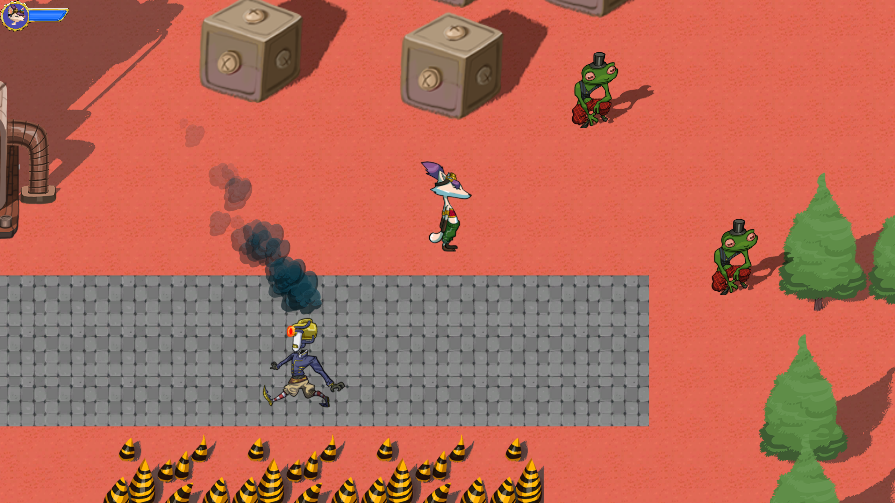

# Ruby
A simple unity project for beginners

* On-line demo: https://cloudrendering.unity.cn/share/7e61ccadd39b6a94

* How to run:

  Please download whole project and run **New Unity Project.exe**

* Press **C** to fire the bullet

* Press **X** to communicate with NPC

